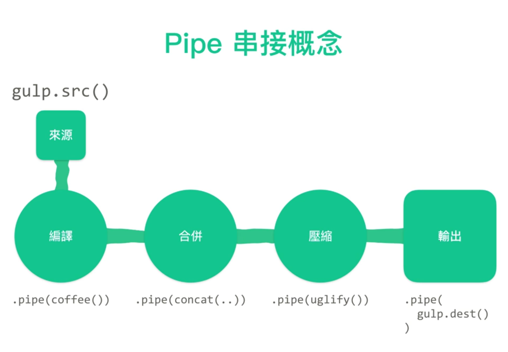

# Gulp

## 简介
参考：
* [https://gulpjs.com/](gulp.js) | [中文网站](https://www.gulpjs.com.cn/)
* [使用 gulp 進行網頁前端自動化](https://www.udemy.com/course/gulp-learning/)

[Gulp](https://gulpjs.com/) 是由[Eric Schoffstall](https://en.wikipedia.org/wiki/Gulp.js#cite_note-:0-4) 开发的一个 node 模块，利用 JavaScript 脚本编写一些列预定的任务，（类似于流水通过管道 pipelines）将多个操作串联依次执行可以实现自动的工作流。

在 Gulp 社区中已经有很多开发者针对不同的（前端）任务将常用的工作流打包成[插件](https://gulpjs.com/plugins)，我们可以通过安装相应的插件，利用多个开发者的预设工作流快速打造属于自己的高效工作流，可以从日常各种繁琐重复的工作中解脱出来。



### 基本语法
Gulp 脚本 `gulpfile.js` 是由各种任务 task 构成的

```js
gulp.task('task_name', function() {
    // input file source
    gulp.src('source_files_path')
    //  multiple pipes
    .pipe($.plumber())
    .pipe($.jade({
      // locals: YOUR_LOCALS
      pretty: true
    }))
    // file output
    .pipe(gulp.dest('output_files_path'))
})
```

## 安装
Gulp 依赖 node.js 环境，而且需要通过 npm 安装

1. 需要先[安装 node](https://nodejs.org/en/)
:warning: 由于不同的项目可能需要在不同 node 版本中运行，推荐使用 [nvm](https://github.com/nvm-sh/nvm) 的方式来安装和控管 node。

2. 安装 gulp 命令行工具

```bash
npm install --global gulp-cli
```

3. 初始化项目

```bash
npm init
```

:bulb: 需要切换到项目目录下，初始化后会在项目中创建 package.json 文件，其中包含项目名、版本、描述等信息。

4. 创建 `gulpfile.js` 文件，并制定各种任务

## 常用插件

* [gulp-watch](https://www.npmjs.com/package/gulp-watch) 相当于「增强型」的 `gulp.watch` 命令，该插件除了可以监听指定（类型）文件的内容变动外，还可以监听指定目录下的（指定类型）文件的添加和删除

* [gulp-jade](https://www.npmjs.com/package/gulp-jade)  HTML 模板语言 jade 编译插件（jade 现在更名为 [pug](https://pugjs.org/api/getting-started.html) | [中文版](https://www.pugjs.cn/api/getting-started.html)，主流的 HTML 模板语言还有 EJS，相应的 gulp 插件是 [gulp-ejs](https://www.npmjs.com/package/gulp-ejs)）

* [gulp-sass](https://www.npmjs.com/package/gulp-sass) CSS 预处理器

* [gulp-plumber](https://www.npmjs.com/package/gulp-plumber) 修改了 Gulp 运行时抛出错误暂停的默认行为，可以在终端输出错误但运行不中断，一般设置在每项任务的导入文件之后

* [gulp-postcss](https://www.npmjs.com/package/gulp-postcss) CSS 后处理器，一般设置在 CSS 预处理器后对编译后的 CSS 进行额外的处理
    * [autoprefixer](https://www.npmjs.com/package/autoprefixer) 它是 gulp-postcss 的拓展插件，根据需求为 CSS 样式添加前缀，实现网页的多浏览器版本适配
    :bulb: 浏览器相容性设置在 `package.json` 文件中

```json
"browserslist": [
"last 1 version",
"> 5%"
]
```
    
* [gulp-load-plugins](https://www.npmjs.com/package/gulp-load-plugins) 可以自动载入 gulp 系列的插件，使代码更简洁提高编写脚本的效率 :warning: 但对于非 gulp 系列的插件，则需要使用 `require` 方法来加载 node_modules 的模块

* [gulp-babel](https://www.npmjs.com/package/gulp-babel) 主流的 JavaScript ES6 编译工具，可以设置兼容的版本

* [gulp-concat](https://www.npmjs.com/package/gulp-concat) 合并多个 JavaScript 脚本
* [gulp-sourcemaps](https://www.npmjs.com/package/gulp-sourcemaps) 配合插件 [gulp-concat](https://www.npmjs.com/package/gulp-concat) 使用，为压缩、合并的代码添加原始位置，方便调试和查错时在原始文件中进行定位

* [Browser Sync](https://www.npmjs.com/package/browser-sync) 创建一个本地服务器，提供 Liveload 功能，适合开发时使用，具体使用方法可以查看[官方说明文档](https://browsersync.io/docs)

* [main-bower-files](https://www.npmjs.com/package/main-bower-files) 配合[前端模块管理工具 Bower](https://bower.io/) 的插件，可以从 `bower.json` 记录（安装）的项目依赖模块中抽取编译出相应的 JavaScript 文件 :bulb: bower 相关设置在 [`.bowerrc` 文件](https://bower.io/docs/config/)中，如设置项目依赖模块的下载目录

* [gulp-minify-css](https://www.npmjs.com/package/gulp-minify-css)  压缩 CSS 插件，一般放在编译完生成 CSS 的插件后

* [gulp-uglify](https://www.npmjs.com/package/gulp-uglify) 压缩 JavaScript 工具

* [minimist](https://www.npmjs.com/package/minimist) 可以接收在终端执行 gulp 命令时输入参数，一般结合 [gulp-if](https://www.npmjs.com/package/gulp-if) 插件让参数作为 gulp 任务的一部分，实现控制 gulp 自动化任务的条件性执行，如可以实现开发环境 develop 和发布环境 production 不同条件性下选择性编译文件

* [gulp-if](https://www.npmjs.com/package/gulp-if) 为 gulp 任务添加判断式功能

* [gulp-clean](https://www.npmjs.com/package/gulp-clean) 删除指定的文件或目录

* [gulp-sequence](https://www.npmjs.com/package/gulp-sequence) 将一系列的 gulp 任务按照顺序 sequence 执行